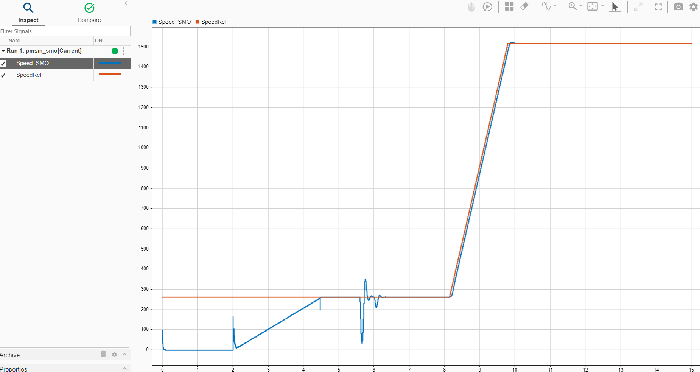

<picture>
    <source media="(prefers-color-scheme: dark)" srcset="images/microchip_logo_white_red.png">
  <source media="(prefers-color-scheme: light)" srcset="images/microchip_logo_black_red.png">
    
</picture> 

# MATLAB/Simulink Model of SMO-based Sensorless FOC for PMSM: MCLV-48V-300W Development Board and dsPI33AK128MC106 Motor Control DIM

## 1. INTRODUCTION

This demonstration describes the setup requirements to drive a Permanent Magnet Synchronous Motor
(PMSM) using Sliding Mode Observer (SMO) based Field Oriented Control (FOC) on the hardware
platform MCLV-48V-300W Development Board ([EV18H47A](https://www.microchip.com/en-us/development-tool/EV18H47A)) and dsPIC33AK128MC106 Motor Control Dual Inline
Module (DIM) ([EV68M17A](https://www.microchip.com/en-us/development-tool/EV68M17A)). 

The MATLAB/Simulink model includes Sensorless Field Oriented Control (FOC) with Sliding Mode Observer (SMO) Estimator referenced from ([AN1078](https://www.microchip.com/en-us/application-notes/an1078)) “Sensorless Field Oriented Control of a PMSM”. 

## 2.	SUGGESTED DEMONSTRATION REQUIREMENTS
### 2.1 MATLAB Model Required for the Demonstration
-  MATLAB model can be cloned or downloaded as zip file from the Github repository ([link](https://github.com/microchip-pic-avr-solutions/matlab-mclv48v300w-33ak128mc106-pmsm-foc-smo)).

### 2.2	Software Tools Used for Testing the MATLAB/Simulink Model
1.	MPLAB X IDE and IPE (v6.25)
2.	XC16 compiler (v3.21)
3.	MATLAB R2024b
4.	Required MATLAB add-on packages
    -	Simulink (v24.2)
    -	Simulink Coder (v24.2)
    -	Stateflow (v24.2)
    -	MATLAB Coder (v24.2)
    -	Embedded Coder (v24.2)
    -	MPLAB Device blocks for Simulink (v3.59)
    - Motor Control Blockset (v24.2)

> **_NOTE:_**
>The software used for testing the model during release is listed above. It is recommended to use the version listed above or later versions for building the model.

### 2.3	Hardware Tools Required for the Demonstration
- Motor Control Low-Voltage 48V-300W Inverter Board ([EV18H47A](https://www.microchip.com/en-us/development-tool/EV18H47A))
- dsPIC33AK128MC106 Motor Control Dual In-line Module ([EV68M17A](https://www.microchip.com/en-us/development-tool/EV68M17A))
- 24V Power Supply ([AC002013](https://www.microchipdirect.com/dev-tools/AC002013)) 
- 24V, 3-Phase Brushless DC Permanent Magnet Hurst Motor ([AC300022](https://www.microchip.com/en-us/development-tool/AC300022))

> **_NOTE:_**
>All items listed under this section Hardware Tools Required for the Demonstration are available at [microchip DIRECT](https://www.microchipdirect.com/).

## 3. HARDWARE SETUP
This section describes the hardware setup required for the demonstration.
> **Note:**  
>In this document, hereinafter the MCLV-48V-300W Development Board is referred as **development board**.
1. Motor currents are amplified on the MCLV-48V-300W development board; it can also be amplified by the amplifiers internal to the dsPIC33AK128MC106 on the DIM. The Simulunk model and DIM are configured to sample and convert internal amplifier outputs (**'internal op-amp configuration'**) by default to measure the motor currents needed to implement FOC. **Table-1** summarizes the resistors to be populated and removed to convert the DIM from **‘internal op-amp configuration’** to **‘external op-amp configuration’** or vice versa.
     

     

2. Insert the **dsPIC33AK128MC106 Motor Control DIM** into the DIM Interface **connector J8** on the development board. Make sure the DIM is placed correctly and oriented before going ahead.
     

     

3. Connect the 3-phase wires from the motor to PHC, PHB and PHA of the **connector J4**, provided on the development board.
      

      

5. Plug the 24V power supply to **connector J1** on the development board. Alternatively, the development board can also be powered through connector J3.
      

      

 
6. The board has an onboard programmer **PICkit™ On Board (PKoBv4)** , which can be used for programming or debugging the microcontroller or dsPIC DSC on the DIM. To use the onboard programmer, connect a micro-USB cable between the Host PC and **connector J16** on the development board.
      

     

7. Alternatively, connect the Microchip programmer/debugger MPLAB® PICkit™ 5 In-Circuit Debugger[(PG164150)](https://www.microchip.com/en-us/development-tool/pg164150) between the Host PC used for programming the device and the **ICSP header J9** on the development board (as shown). Ensure that PICkit 4 is oriented correctly before proceeding.
      

       

 
  
 
## 4.	BASIC DEMONSTRATION

 Follow the below instructions step-by-step, to set up and run the motor control demo application:

1. Launch MATLAB (refer the section ["2.2 Software Tools Used for Testing the MATLAB/Simulink Model"](#22-software-tools-used-for-testing-the-matlabsimulink-model)). 
 

2. Open the folder downloaded from the repository, in which MATLAB files are saved (refer the section ["2.1 MATLAB Model Required for the Demonstration"](#21-matlab-model-required-for-the-demonstration)).
    

    

3.	
 Double click and open the MATLAB script file (.m file). This script file contains the configuration parameter for the motor and board. By default, the script file is configured to run Hurst 300 motor and development board. Run the file by clicking the <b>“Run”</b> icon and wait till all variables gets loaded on the <b>‘Workspace’</b> tab.
    
    

      

    

4.	Double click on the Encoder FOC Simulink model - <b>pmsm_smo.slx</b>.
    
    

      

    

5.	
This opens the Simulink model as shown below. Click on the <b>"Run"</b> icon to start the simulation.
    
    

      

    

6.	
To plot the simulation result, <b>Data Inspector</b> is used (refer to figure below). To observe the additional signals, log them as required. Alternatively, normal Simulink Scope can be used to plot the signals.
    
    

      

    

7.	
From this Simulink model an MPLAB X project can be generated, and it can be used to run the PMSM motor using development board. 
To generate the code from the Simulink model, go to the <b>"MICROCHIP"</b> tab, and enable the tabs shown in the figure below. 
    
    

      

    

8.	
	To generate the code, click on <b>"Build" </b> option under the <b>“Microchip”</b> tab and <b>"Build, Deploy & Start" </b> drop down. This will generate the MPLAB X project from the Simulink model and program the dsPIC33AK128MC106 device.
    
    

      

    

9.	
After completing the process, the <b>‘Operation Succeeded’</b> message will be displayed on the <b>‘Diagnostics Viewer’</b>.
    
    

      

    

10.	If the device is successfully programmed, <b>LED1 - LD2</b> and the <b>LED2 - LD3</b> will be blinking.
   
    

      

    

11.	To Run the motor, press the push button <b>SW1</b>.
    
    

      
 
    

12.	The motor speed can be varied using the potentiometer (labeled <b>“POT”</b>).
    
    

      

    

13.	Press the push button <b>SW1</b> to stop the motor. Make sure motor is reduced minimum potentimeter value before stopping the motor.
    
    

      

    

    
## 5. DATA VISUALIZATION USING MOTOR CONTROL BLOCKSET (MCB) HOST MODEL

The FOC model comes with the initialization required for data visualization using Motor Control Blockset Host Model (MCB Host Model). The MCB Host Model is a Simulink model which facilitates data visualization through the UART Serial Interface.

1. 
To establish serial communication with the host PC, connect a micro-USB cable between the host PC and connector J16 on the development board. This interface is also used for programming.

2. 
Enter the COM port number of the USB connection in the MATLAB script file.
    

      

    

3. Ensure the SMO-based sensorless FOC model is programmed and running as described under section ["4. Basic Demonstration"](#4-basic-demonstration) by following steps 1 through 13.
4. Open the **mcb_hostmodel_dsPIC33A.slx** model and click on the **Run** icon to plot the real time data.
    

      

    

5. Select the signals on **Debug Select Value** pannel to plotted available signals on the scope.
    

      

    

## 	REFERENCES:
For more information, refer to the following documents or links.
1. Application Note on "Sensorless Field Oriented Control of a PMSM" [(AN1078)](https://www.microchip.com/en-us/application-notes/an1078)
1.	MCLV-48V-300W Development Board User’s Guide [(DS50003297)](https://ww1.microchip.com/downloads/aemDocuments/documents/MCU16/ProductDocuments/UserGuides/Motor-Control-Low-Voltage-48V-300W-Inverter-Board-Users-Guide-DS50003297.pdf)
2. dsPIC33AK128MC106 Motor Control Dual In-Line Module (DIM) Information Sheet [(DS70005527)](https://ww1.microchip.com/downloads/aemDocuments/documents/MCU16/ProductDocuments/InformationSheet/dsPIC33AK128MC106-Motor-Control-Dual-In-Line-Module-DIM-Information-Sheet-DS70005527.pdf)
3. dsPIC33AK128MC106 Family datasheet [(DS70005539)](https://ww1.microchip.com/downloads/aemDocuments/documents/MCU16/ProductDocuments/DataSheets/dsPIC33AK128MC106-Family-Data-Sheet-DS70005539.pdf)
4. MPLAB® X IDE User’s Guide [(DS50002027)](https://ww1.microchip.com/downloads/en/DeviceDoc/50002027E.pdf) or [MPLAB® X IDE help](https://microchipdeveloper.com/xwiki/bin/view/software-tools/x/)
5. [MPLAB® X IDE installation](http://microchipdeveloper.com/mplabx:installation)
6. [MPLAB® XC-DSC Compiler installation](https://developerhelp.microchip.com/xwiki/bin/view/software-tools/xc-dsc/install/)
7.  [Motor Control Blockset](https://in.mathworks.com/help/mcb/)
8.  [MPLAB Device Blocks for Simulink :dsPIC, PIC32 and SAM mcu](https://in.mathworks.com/matlabcentral/fileexchange/71892-mplab-device-blocks-for-simulink-dspic-pic32-and-sam-mcu)
 