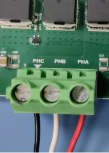
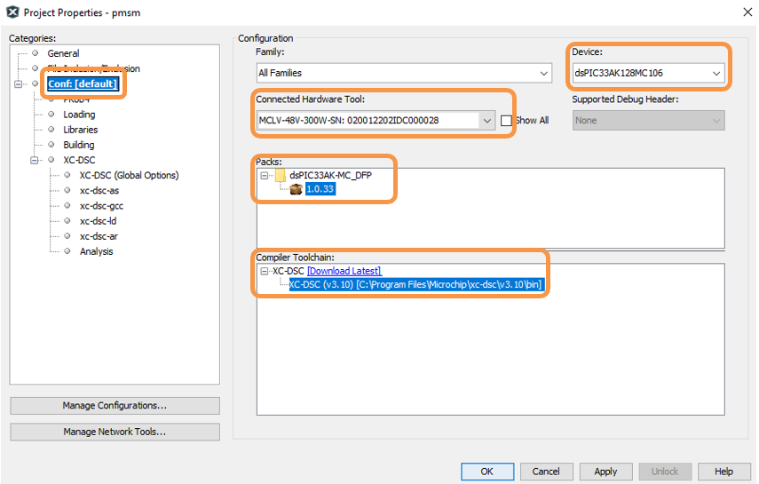

 
## X2C Model based FOC using PLL Estimator for PMSM : MCLV-48V-300W and dsPIC33AK128MC106 Motor Control DIM

* Encoder based and Sensorless options
* Speed control, Torque control, Open loop 
* Model sample time 50us (20kHz)

## 1. INTRODUCTION
This document describes the setup requirements for driving a Permanent Magnet Synchronous Motor (PMSM) using Encoder oe Sensorless Field Oriented Control (FOC) and PLL Estimator Algorithm on the hardware platform [EV18H47A](https://www.microchip.com/en-us/development-tool/ev18h47a) "MCLV-48V-300W Development Board"  and [EV68M17A](https://www.microchip.com/en-us/development-tool/ev68m17a) "dsPIC33AK128MC106 Motor Control Dual In-line Module (DIM)".

For details about PLL estimator, refer to Microchip application note [AN1292](https://ww1.microchip.com/downloads/aemDocuments/documents/OTH/ApplicationNotes/ApplicationNotes/01292A.pdf) “Sensorless Field Oriented Control (FOC) for a Permanent Magnet Synchronous Motor (PMSM) Using a PLL Estimator and Field Weakening (FW)”
 

## 2. Setup

### 2.1 Software Tools Used for Testing the firmware

- MPLAB® X IDE **v6.20** 
- Device Family Pack (DFP): **dsPIC33AK-MC_DFP v1.0.33**
- MPLAB® XC-DSC Compiler **v3.10**

### 2.3 Hardware Tools Required for the Demonstration
- MCLV-48V-300W Development Board [(EV18H47A)](https://www.microchip.com/en-us/development-tool/ev18h47a)
- dsPIC33AK128MC106 Motor Control Dual In-line Module [(EV68M17A)](https://www.microchip.com/en-us/development-tool/ev68m17a)
- 24V Power Supply [(AC002013)](https://www.microchipdirect.com/dev-tools/AC002013)
- 24V 3-Phase Brushless DC Motor - Hurst DMA0204024B101 [(AC300022)](https://www.microchip.com/en-us/development-tool/AC300022)

## 3. HARDWARE SETUP

1. Motor currents are amplified on the MCLV-48V-300W development board; it can also be amplified by the amplifiers internal to the dsPIC33AK128MC106 on the DIM. The firmware and DIM are configured to sample and convert internal amplifier outputs (**'internal op-amp configuration'**) by default to measure the motor currents needed to implement FOC. **Table-1** summarizes the resistors to be populated and removed to convert the DIM from **‘internal op-amp configuration’** to **‘external op-amp configuration’** or vice versa.

     

     

2. Insert the **dsPIC33AK128MC106 Motor Control DIM** into the DIM Interface **connector J8** on the development board. Make sure the DIM is placed correctly and oriented before going ahead.

     

     

3. Connect the 3-phase wires from the motor to PHC, PHB, and PHA of the **connector J4**(no specific order), provided on the development board.

     

      

4. Plug the 24V power supply to **connector J1** on the development board. Alternatively, the development board can also be powered through connector J3.
      

      

 

 5. The board has an onboard programmer **PICkit™ On Board (PKoBv4)** , which can be used for programming or debugging the microcontroller or dsPIC DSC on the DIM. To use the onboard programmer, connect a micro-USB cable between the Host PC and **connector J16** on the development board.
      

     

## 4.  BASIC DEMONSTRATION
### 4.1 Firmware Description
The firmware version needed for the demonstration is mentioned in the section [Motor Control Application Firmware Required for the Demonstration](#21-motor-control-application-firmware-required-for-the-demonstration) section. This firmware is implemented to work on Microchip’s Digital signal controller (dsPIC® DSC) **dsPIC33AK128MC106**. For more information, see the **dsPIC33AK128MC106 Family datasheet [(DS70005539)](https://ww1.microchip.com/downloads/aemDocuments/documents/MCU16/ProductDocuments/DataSheets/dsPIC33AK128MC106-Family-Data-Sheet-DS70005539.pdf)**.

The Motor Control Demo application uses a push button to start or stop the motor and a potentiometer to vary the speed of the motor. This Motor Control Demo Application configures and uses peripherals like PWM, ADC, UART, etc. For more details, refer to Microchip Application note **[AN1292](https://ww1.microchip.com/downloads/aemDocuments/documents/OTH/ApplicationNotes/ApplicationNotes/01292A.pdf), “Sensorless Field Oriented Control (FOC) for a Permanent Magnet Synchronous Motor (PMSM) Using a PLL Estimator and Field Weakening (FW)”** available on the [Microchip website](https://www.microchip.com/en-us/application-notes).

### 4.2 Basic Demonstration
Follow the below instructions, step by step, to set up and run the motor control demo application:

1. Start **MPLAB X IDE** and open the project **pmsm.X (File > Open Project)** with device selection **dsPIC33AK128MC106.**  
    

       

  

2. Set the project **pmsm.X** as the main project by right-clicking on the project name and selecting **Set as Main Project** as shown. The project **pmsm.X** will then appear in **bold.**
    

     

3. Right-click on the project **pmsm.X** and select **Properties** to open its **Project Properties** Dialog. Click the **Conf:[default]** category to reveal the general project configuration information. The development tools used for testing the firmware are listed in section [2.2 Software Tools Used for Testing the firmware.](#22-software-tools-used-for-testing-the-firmware)

     In the **Conf:[default]** category window: 
     - Ensure the selected **Device** is **dsPIC33AK128MC106.**
     - Select the **Connected Hardware Tool** to be used for programming and debugging. 
     - Select the specific Device Family Pack (DFP) from the available list of **Packs.** In this case, **dsPIC33AK-MC_DFP 1.0.33** is selected. 
     - Select the specific **Compiler Toolchain** from the available list of **XC-DSC** compilers. 
     In this case, **XC-DSC(v3.10)** is selected.
     - After selecting Hardware Tool and Compiler Toolchain, Device Pack, click the button **Apply**

     Please ensure that the selected MPLAB® XC-DSC Compiler and Device Pack support the device configured in the firmware

     

     

4. To build the project (in this case, **pmsm.X**) and program the device dsPIC33AK128MC106, click **Make and Program Device Main project** on the toolbar
    

    

  
5. If the device is successfully programmed, **LED1 (LD2)** will be **blinking**, indicating that the dsPIC® DSC is enabled.
    

     

6. Run or stop the motor by pressing the push button **SW1.** The motor should start spinning smoothly in one direction in the nominal speed range. Ensure that the motor is spinning smoothly without any vibration. The LED **LED2(LD3)** is turned **ON** to show the button is pressed to start the motor.
     

     

 

8. The motor speed can be varied using the potentiometer **(POT1).**
    

    

9. Press the push button **SW1** to stop the motor.

